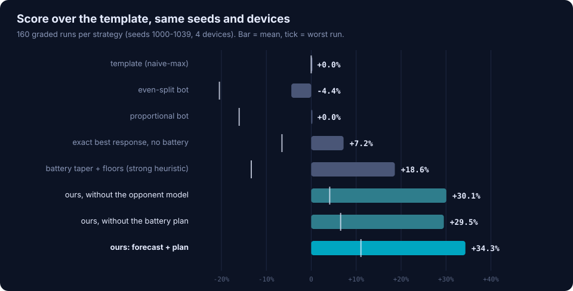
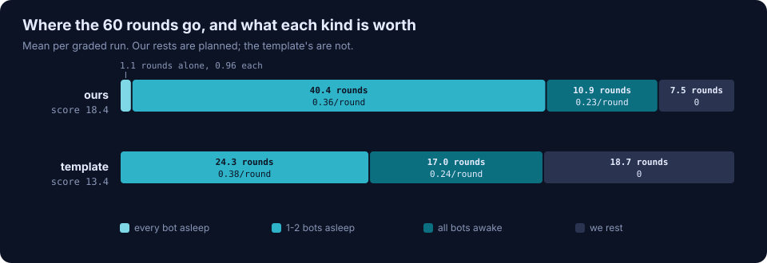
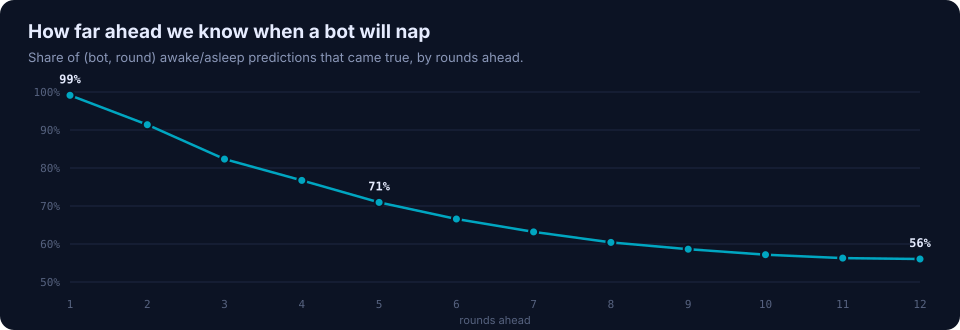
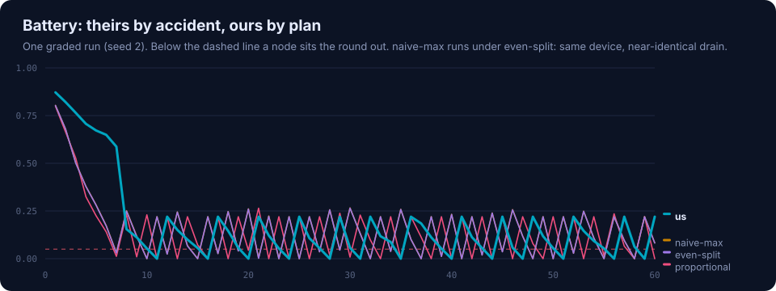
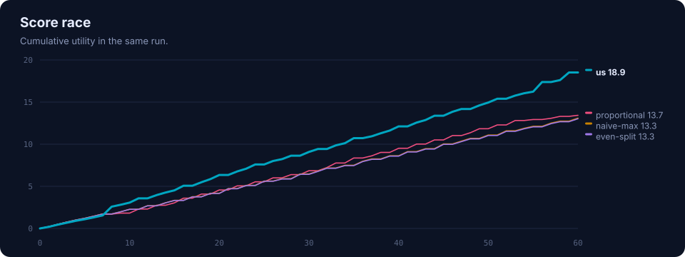

# NullPointerException · CoGNETs Swarm Arena agent

**VelesHack 2026, Challenge 4 (CoGNETs): Smart Edge Resource Auctions.**
An edge-node agent that computes the market instead of estimating it, forecasts
when its rivals will run flat, and plans its battery for the whole run.

| | |
|---|---|
| Team | `NullPointerException` (the exact `TEAM_NAME` used all event) |
| Members | Sanchay Singh |
| Dockerfile | `agent-template/Dockerfile` |
| Build | `docker build -t nullpointerexception/agent agent-template` |
| Conformance | `make check` and `make check-docker IMAGE=nullpointerexception/agent`: all 8 checks pass |
| Licence | Apache-2.0 ([LICENSE](LICENSE)) |



**+34.9% over the template**, ahead of all three bots in **160 of 160** graded
runs on unseen seeds and four devices; worst run +13.6%; 2 floor misses in
9,600 rounds. On a live arena the opponent forecast matched the truth in 48 of
48 decisions.

---

## Strategy (the 300-word version)

Three facts decide this game, and all three are public. The energy you win
drains your battery, and a flat node scores nothing. The baseline bots are open
source and run on a copy of our device. And `/v1/swarm` publishes every node's
charge, every round.

So we stopped estimating the market and started computing it. Each round the
agent reads the swarm, knows who is awake, and replays the bots' own logic on
the public round data to reproduce their bids to six decimals. The clearing
price checks that forecast after every round (mean error 0.00%); a residual
absorbs anything it cannot explain. With the field known exactly, both service
floors are bought at the exact minimum instead of with a 20% margin.

The bots never manage their batteries, so their naps are predictable: rolling
their shadows forward tells us who will be asleep one round ahead 99% of the
time, three rounds ahead 82%. That forecast feeds a dynamic programme over our
battery for the rest of the run. For every candidate energy spend it knows the
round's best utility and its battery cost, and it trades rounds against each
other. Out comes a rhythm no rule of thumb produces: sip energy in crowded
rounds, spend it when rivals sleep, rest on purpose when they wake, and empty
the battery on the last round.

What did not pay: re-scoring candidate bids with a fresh swarm rollout each,
and planning over sampled capacity futures. Neither moved the score beyond
noise, at twice the compute, so both are switched off.

And yes, we take from the swarm. With us in the seat instead of the template,
the bots lose 12.2% of their score while total swarm utility falls only 1.4%:
the gain is mostly redistribution.

---

## How it works

```
                 every round, before bidding
 /v1/round ──┐
 /v1/swarm ──┼─► opponents.Market ──► field S_k (exact) ──► planner.round_menu ──┐
             │      shadows of the 3 bots, checked              utility & battery  │
             │      against the clearing price                  cost per energy    │
             │                                                  spend, floors      │
             └─► strategy._forecast ─► who is awake, rounds ahead ─► menus ───────►├─► planner.plan (DP)
                    bots rolled forward under our own plan                         │     battery for the
                                                                                   │     rest of the run
                                                          bid ◄── this round's ◄───┘
```

| File | What it does |
|---|---|
| [`agent-template/strategy.py`](agent-template/strategy.py) | The decision: forecast, plan, bid. Layered fallbacks; `decide_bid` keeps the template signature |
| [`agent-template/opponents.py`](agent-template/opponents.py) | Opponent model: bot shadows, swarm sync, residual for unknown nodes, self-healing history, battery physics fitted online |
| [`agent-template/planner.py`](agent-template/planner.py) | Per-round menu (exact Kelly inversion for the floors) and the finite-horizon battery DP, vectorised with numpy |
| [`agent-template/econ.py`](agent-template/econ.py) | The arena's maths (Kelly share, CES utility, floors), restated and unit-tested against `arena/game.py` |
| [`agent-template/agent.py`](agent-template/agent.py) | The template loop plus a swarm snapshot per round (also on rest rounds), decision logs, optional telemetry |
| [`agent-template/client.py`](agent-template/client.py) | Template client plus deadline-aware retries on the critical path |
| [`agent-template/telemetry.py`](agent-template/telemetry.py), [`dashboard/`](agent-template/dashboard/index.html) | Optional live dashboard (`TELEMETRY_PORT`) |
| [`lab/`](lab) | Simulator, experiments, charts, replay: every number in this README |
| [`tests/test_agent.py`](tests/test_agent.py) | Unit tests (stdlib `unittest`) |

### Engineering choices worth knowing

- **Configuration is environment only.** `ARENA_URL`, `TEAM_NAME`, `LOG_LEVEL`,
  `TELEMETRY_PORT` (off by default, so the graded container is a plain agent).
  No URLs, ports or secrets in code.
- **The bid never waits on bookkeeping, and never sleeps past the round.**
  Injected 503s are independent dice rolls, so the template's "wait the full
  `Retry-After`" lost a round in our first conformance run. Reading the round,
  bidding and fetching results now back off exponentially with full jitter from
  60 ms and keep trying until the round actually closes. Under a 45% fault rate
  with 2-second rounds this took misses from 4 to 1 in 25 rounds.
- **Every result is read.** The template loop asks only for the result of the
  round it has just bid in, which has not settled; by the time it has, the
  loop is bidding in the next one. It read 1 result in 49 live rounds. Results
  are now owed per round and read once the round is over (46 of 49). The
  baseline bots run that same loop, so their history is almost always stale,
  and the opponent model learns which past result the proportional bot is
  really using.
- **A bid can never be over budget.** Rounding to six decimals after scaling
  could leave a bid 1.5e-6 over, past the arena's tolerance: a compromise
  penalty. Our bids round down (found by the unit tests, not by the arena).
- **Every layer has a fallback.** No swarm snapshot: estimate the field from
  the clearing price. Forecast stops matching the truth: widen the floor margin
  with the measured error. Planner raises: a safe battery-aware bid. A strategy
  bug costs score, never the run.
- **Thinking is bounded.** About 50 ms per round; optional refinement passes
  stop after `THINK_BUDGET` (0.6 s) so a slow host cannot cost a round.
- **One log line per decision**: battery, who is awake, the bid, the expected
  utility, the shadow price of charge, model error, think time.

---

## What we measured

All numbers: graded scenario, seeds 1000-1039 (never used while developing),
four devices including our own, 160 runs per strategy. Reproduce with
`python lab/experiments.py` (about three minutes); raw data in
[`docs/results/results.json`](docs/results/results.json).

| Strategy in our seat | vs template | worst run | beats all 3 bots | rested | floor misses |
|---|--:|--:|--:|--:|--:|
| template (naive-max) | 0.0% | 0.0% | 0% | 18.7 | 1.54 |
| even-split bot | -3.8% | -20.1% | 0% | 19.5 | 2.54 |
| proportional bot | +6.1% | -16.4% | 14% | 18.0 | 2.54 |
| exact best response, battery-blind | +7.8% | -3.0% | 8% | 18.9 | 0.05 |
| battery taper + floors (strong heuristic) | +20.0% | -14.5% | 88% | 1.4 | 0.23 |
| ours without the opponent model | +31.0% | +8.5% | 99% | 7.2 | 0.44 |
| ours without the battery plan | +30.2% | +7.8% | 97% | 7.4 | 0.01 |
| **ours** | **+34.9%** | **+13.6%** | **100%** | 7.4 | **0.01** |

The heuristic lands where the organisers place their reference agent ("about
22% ahead"), which is a useful check that the simulator is faithful.

**Each half earns its place.** Remove the opponent model or the battery plan
and about four to five points go, and the worst run gets markedly worse. The
heuristic that most teams will converge on (taper energy by charge, buy floors
with a margin) rests barely at all and still gets less than two thirds of our
margin: not resting is not the same as resting well.

**The primer's "best response is worth ~2%" holds for the split, not the
floors.** A battery-blind exact best response gets +7.8%, and much of that is
buying both floors at the exact minimum (1.54 misses per run to 0.05), which
needs the exact field that the shadows provide.



**Where the points come from.** We rest 7.5 rounds per run instead of 18.7,
and those rests are scheduled: we spend 40.4 rounds in thin markets, with one
or two bots asleep, against the template's 24.3. A thin round pays about 0.36
against 0.23 for a crowded one. The rare round with every bot asleep pays
0.96, four times a crowded round.



**How far ahead the swarm is predictable.** Almost perfectly one round ahead
(99%), because batteries are public and this round's market is known. Beyond
that, the unknown capacity draws blur the bots' drain; accuracy falls to 72%
at five rounds. The plan is re-solved every
round, so it only ever acts on the near, accurate part.




### Robustness: conditions the agent never saw

| Condition | template | heuristic | ours | ours, worst run |
|---|--:|--:|--:|--:|
| graded, as published | 0.0% | +19.8% | +36.9% | +17.7% |
| battery drains 50% faster, recharges 32% slower | 0.0% | +29.1% | +46.4% | +19.8% |
| battery drains 33% slower | 0.0% | +10.4% | +23.9% | +10.2% |
| an unknown extra agent in the swarm | 0.0% | +17.7% | +38.8% | +14.5% |
| joins the run at round 12 | 0.0% | +21.4% | +35.8% | +8.2% |
| practice scenario (40 rounds, 6 s) | 0.0% | +22.5% | +35.5% | +11.8% |

The physics constants are not published to agents; the agent starts from the
scenario defaults and re-fits the drain rate from its own round results and
the recharge rate from its own rests.

### The honest welfare answer

| | with the template | with ours |
|---|--:|--:|
| our score | 13.50 | 18.15 |
| the three bots, total | 44.81 | 39.35 (-12.2%) |
| whole swarm, total utility | 58.31 | 57.49 (-1.4%) |
| log social welfare per round | -3.08 | -3.20 |

We did not make the swarm better off; we made ourselves better off, mostly at
the bots' expense. Two mechanisms: we crowd into the thin rounds the bots
would otherwise share among fewer nodes, and by drawing little energy we leave
more of the energy pool to the bots, who drain faster and sleep more: with us
in the seat the three bots rest 63.4 rounds per run between them, against 56.9
with the template (+11%, 40 runs). In the full CoGNETs pipeline the
Stage 1 bargaining prices exist to align individual and collective outcomes;
publishing realised prices instead, as this reduction does, removes that
alignment, and our numbers show what that costs.

---

## Run it

```bash
cp .env.example .env               # TEAM_NAME=NullPointerException
make up                            # arena + the three bots on :8080
make agent                         # our agent
make demo                          # the same, with the live dashboard on :8090
make check                         # the organisers' conformance suite
make test                          # unit tests
make replay                        # a simulated run in the dashboard, no Docker needed
python lab/sim.py --help           # compare strategies over many seeds
python lab/experiments.py          # regenerate every number above
python lab/charts.py               # and every figure
```

`lab/` needs the arena installed (`pip install -e .`) plus `numpy`; the agent
image needs only `agent-template/requirements.txt`.

---

## Credits

The arena, the baseline bots, the template agent and the challenge
documentation are by the CoGNETs Consortium (Apache-2.0); the original README
is kept at [`docs/challenge.md`](docs/challenge.md). Everything under `lab/`,
`tests/test_agent.py`, `demo/`, and the agent's `strategy.py`, `opponents.py`,
`planner.py`, `econ.py`, `telemetry.py` and `dashboard/` was written during the
event by team NullPointerException, along with the changes to `agent.py` and
`client.py` described above.
